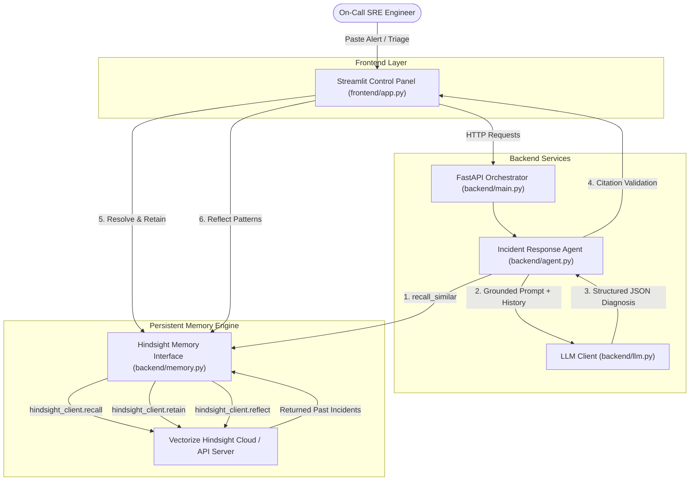

# OnCallMemory: Persistent AI Incident Response Agent

[](https://www.python.org/)
[](https://hindsight.vectorize.io/)
[](https://fastapi.tiangolo.com/)
[](https://streamlit.io/)

**OnCallMemory** is an enterprise-grade AI Incident Response Agent built for on-call engineers and Site Reliability Engineers (SREs), submitted for **HackwithHyderabad 3.0**. By leveraging **Vectorize Hindsight** as its persistent memory engine, OnCallMemory transforms production alert triage from generic guessing into precise, historical-memory-grounded remediation.

Live Demo: https://weerjcrgpk7ov99rfwsatj.streamlit.app/

## 🎯 The Problem

When severe production alerts trigger (e.g. `checkout-api` latency spikes or Kubernetes `OOMKilled` crash loops), on-call engineers waste critical minutes searching postmortems, old Slack threads, or outdated runbooks to remember how a similar issue was fixed before. 

Generic AI assistants suffer from **stateless context loss**: they receive only the current alert and output ungrounded, generic recommendations like *"inspect your server metrics and restart the pod"*.

---

## 💡 The Solution & Why Hindsight?

**OnCallMemory** creates a continuous learning loop grounded in corporate incident memory:

1. **`Retain`**: Automatically indexes resolved incidents (symptoms, stack traces, root causes, exact fix steps, and engineer feedback) into Hindsight memory banks.
2. **`Recall`**: Queries Hindsight when a new alert occurs, retrieving top historical resolution memories with similarity scores and metadata.
3. **`Reflect`**: Reasons across stored incident history to discover systemic patterns (e.g., unclosed PostgreSQL connections leaking after Friday releases).

Unlike generic vector search, Hindsight provides **biomimetic memory primitives** (`retain`, `recall`, `reflect`) with multi-strategy retrieval, tag scoping, and knowledge synthesis.

---

## 🏗️ Architecture



---

## 🧠 Hindsight Integration Details

Hindsight Python SDK (`hindsight-client`) operations in [backend/memory.py](file:///c:/Projects_2026/OnCallMemory/backend/memory.py):

### 1. `Retain` (Indexing Incidents & Resolution Outcomes)
- **Function**: `memory_engine.retain_incident(bank_id, incident, worked=True)`
- **SDK Call**: `self.client.retain(bank_id=..., content=..., metadata=..., document_id=...)`
- **Purpose**: Stores symptom logs, root causes, remediation steps, and resolution feedback (`worked=True/False`) into the memory bank (`oncall-incidents-team-alpha`).

### 2. `Recall` (Contextual Incident Retrieval)
- **Function**: `memory_engine.recall_similar(bank_id, query, top_k=3)`
- **SDK Call**: `self.client.recall(bank_id=..., query=..., budget="mid")`
- **Purpose**: Performs natural language semantic search across historical memories to find previous incidents matching the incoming stack trace.

### 3. `Reflect` (Agentic Pattern Reasoning)
- **Function**: `memory_engine.reflect_patterns(bank_id, query)`
- **SDK Call**: `self.client.reflect(bank_id=..., query=..., budget="low")`
- **Purpose**: Synthesizes higher-level pattern analytics across all team memories (e.g. identifying high-risk deployment days or recurring HikariPool leaks).

---

## ⚖️ Memory OFF vs Memory ON Comparison

OnCallMemory features a dedicated **Side-by-Side Comparison Mode**:

| Feature | Memory OFF (Generic AI) | Memory ON (Hindsight Grounded) |
| :--- | :--- | :--- |
| **Context** | Current alert text only | Current alert + Recalled Hindsight Memories |
| **Root Cause** | Generic hypothesis | Specific root cause derived from past incidents |
| **Remediation** | Broad advice (*"check logs"*) | Step-by-step corporate runbook procedures |
| **Citations** | None (0 cited) | Exact historical Incident IDs (e.g., `INC-1025`) |
| **Grounding** | Low (Ungrounded) | High (Strict Citation Validated) |


## 🚀 Quickstart & Running the Application

### 1. Install Dependencies
```bash
pip install -r requirements.txt
```

### 2. Seed Hindsight Memory Bank
Populates the memory bank with 30 realistic synthetic historical incidents:
```bash
python data/seed_memory.py
```

### 3. Launch Application
Launch both backend API and Streamlit UI in one command:
```cmd
.\run.bat
```
*(Or launch manually)*:
```bash
# Terminal 1: FastAPI Backend
python backend/main.py

# Terminal 2: Streamlit Frontend
streamlit run frontend/app.py

## 🧪 Running Tests

Run the full pytest suite:
```bash
python -m pytest
```

Tests cover:
- Hindsight Memory Engine SDK calls (`tests/test_memory.py`)
- Agent Memory ON vs Memory OFF orchestration (`tests/test_agent.py`)
- Citation validation against hallucinated incident IDs (`tests/test_citation_validation.py`)

---

## 🛡️ Technical Honesty & Fallback Transparency

- OnCallMemory performs **live API calls** to Vectorize Hindsight Cloud.
- If network connectivity is lost, the sidebar dynamically updates to **`🔴 HINDSIGHT UNAVAILABLE`**, and telemetry logs clearly show **`🟡 LOCAL FALLBACK`** rather than faking success.
- Synthetic incident data in `data/incidents.json` is clearly documented for demonstration purposes.
